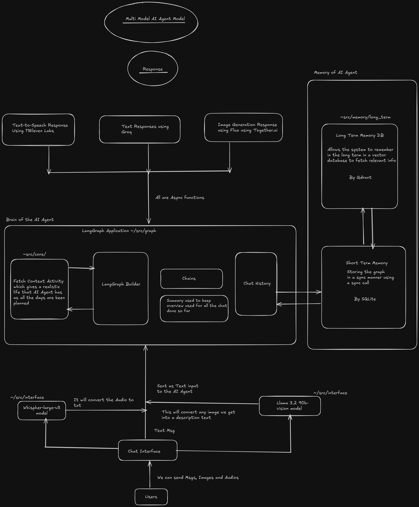

# Multi-Model Chatbot

This project is a multi-model AI chatbot supporting image generation, image-to-text, speech-to-text, text-to-speech, and more, with modular AI components and a modern Chainlit chat interface.

## Architecture



*The diagram illustrates the flow between users, the chat interface, core AI modules (Whisper, Llama, LangGraph, memory components), and the types of data exchanged (messages, images, audio, etc.).*

## Features
- Image generation (text-to-image)
- Image-to-text (vision)
- Speech-to-text (Whisper)
- Text-to-speech (ElevenLabs)
- Long-term and short-term memory modules (Qdrant, SQLite)
- Chainlit interface for chat

---

## Installation & Setup

### 1. Prerequisites
- **Python 3.12+**
- **Docker** (for Qdrant vector database)
- **uv** (fast Python package/dependency manager)

#### Install uv (if not already installed)
```bash
pip install uv
```

### 2. Clone the Repository
```bash
git clone <repo-url>
cd Multi-Model-Chatbot-main
```

### 3. Setup & Run (Automated)
All setup and service management is automated via the provided script:

```bash
./run_local.sh start
```

- This will:
  - Create a virtual environment using `uv` (if not present)
  - Install all dependencies using `uv`
  - Start Qdrant (via Docker)
  - Start the Chainlit UI

#### Other commands:
- Stop all services:
  ```bash
  ./run_local.sh stop
  ```
- Restart services:
  ```bash
  ./run_local.sh restart
  ```
- Show status:
  ```bash
  ./run_local.sh status
  ```
- Show Chainlit logs:
  ```bash
  ./run_local.sh logs chainlit
  ```
- Setup environment only (no services):
  ```bash
  ./run_local.sh setup
  ```

### 4. Environment Variables
Create a `.env` file in the project root. Here is an example:

```ini
GROQ_API_KEY=""

ELEVENLABS_API_KEY=""
ELEVENLABS_VOICE_ID=""

TOGETHER_API_KEY=""

QDRANT_URL=""
QDRANT_API_KEY=""


```

---

## Running the Chatbot

- The Chainlit UI will be available at: [http://localhost:8000](http://localhost:8000) (or the port shown in the status output)

---

## Directory Structure
- `src/ai_companion/` - Main source code
- `generated_images/` - Output images
- `logs/` - Log files
- `long_term_memory/` - Long-term memory storage (Qdrant)
- `short_term_memory/` - Short-term memory (SQLite DB)

---

## Contributing
Pull requests are welcome! For major changes, please open an issue first to discuss what you would like to change.

---

## License
[MIT](LICENSE) 